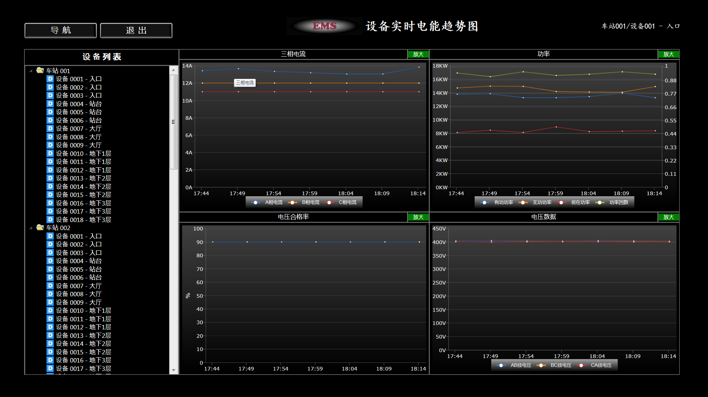

# EMS (Energy Management System)
Energy Management System is an [ISCS](https://github.com/zhanghongzhi1234/ISCS-demo) application used by electric operators to monitor, control, and optimize the performance of the generation or transmission system. Currently it used in Guangzhou Metro Line 9, Line 13 project and Suzhou Line 5 project.

# Background
1) Energy consumption data:  
Energy consumption data refers to the electrical energy consumed by the circuit per unit time. The multifunctional power monitoring terminal of the energy consumption system collects the positive and negative active energy of the circuit, and the positive and negative reactive energy data of the circuit are sent to the electric energy supervision as a cumulative value. System, the electric energy monitoring system calculates the difference in electricity per unit time, and obtains the energy consumption data for that time period. Energy consumption data is the basis for calculation and statistics of electric energy and reports.
2) Power quality data:  
Power quality data refers to instantaneous data such as current, voltage, frequency, fundamental wave current, fundamental wave voltage, harmonic current, harmonic distortion rate, power, and power factor collected by the electric meter. This data represents the power condition of the loop at a certain point in time. Power quality data can be used to detect the power status of the loop, the cause of the failure can be found by analyzing historical trends, and the impact of a certain device on the power quality of the power grid can be analyzed.
3) Display device name  
The device name is displayed in the form of device name + device number + loop number.
like:  
801 incoming line is displayed as: incoming line 801 (IP01)  
The lighting M13 on the basement floor is displayed as: the lighting M13 on the basement floor (IPA5-1)  
The name of the environmental control device adopts: device name + environmental control number + loop number to display:  
Station tunnel fan TVF-619-02 (IILA2-1)
4) Calculation formula  
In addition to the electric energy information provided in the EMS system point table, the electric energy supervision system also needs to calculate the following electric energy information through formulas:  
+ 2 Incoming line voltage harmonic content rate  
  2 Incoming line voltage harmonic content rate is 2 incoming line total harmonic distortion rate THD Va/Vb/Vc
+ Three-phase current unbalance  
The calculation formula is: current average value Ipj=(Ia+Ib+Ic)/3  
Phase A current unbalance = Ia-Ipj  
Phase B current unbalance = Ib-Ipj  
C-phase current unbalance = Ic-Ipj  
+ 2 Incoming line voltage qualification rate  
2 Incoming line voltage qualification rate is the percentage of the number of voltage deviation values ​​collected at the monitoring point within a unit time within the qualified range (±15%) to the total number of collections.  
Voltage qualification rate = (number of qualified test points/total number of test points) X 100%  
If 10 three-phase voltage values ​​are collected per unit time, and the number of (voltage deviation value/380)<=±15% is 8, the voltage qualification rate is 80%  
The current tentative statistical unit time is 1 hour.  

# System Architecture
The electric energy supervision system adopts the C/S architecture to realize the system functions. EMS electric energy data and BAS electric energy data are collected through the FEP of the station/parking lot. The electric energy supervision system server program regularly polls the FEP to collect electric energy data; the electric energy data of the PSCADA subsystem passes The ISCS system collects records to the local database. After the electric energy data of each station and parking lot is collected, it is stored in the local real-time database and synchronized to the central historical database in real time. Full-line level statistics and report generation are realized by analyzing and counting the full-line electrical energy data in the central historical database. The architecture of the power supervision system is shown in the figure below:  

# Function description
## Data Collection
The system collects energy consumption information related to EMS and BAS through FEP, the frequency of the FEP acquisition subsystem remains unchanged, and the frequency of the acquisition module to collect FEP information is divided into three types:
+ The collection frequency of power equipment status information (including equipment communication failures, failure alarms, loss of voltage and phase failure, and phase sequence errors) is 500 milliseconds;
+ The collection frequency of power quality data (including current, voltage, power, power factor, frequency, voltage deviation, harmonic distortion rate, harmonic current and other data) is 10 seconds;
+ Energy data (including positive and negative active energy, positive and negative reactive energy data) is 15 minutes;
## Launch EMS
Activation method: Add the power supervision system menu item in the comprehensive monitoring menu-[station equipment] menu bar, and click the menu to pop up the power supervision system window. After the power monitoring system client program is started, the full screen is displayed, and the operator can minimize, close, and move the window through the title bar.  

## Power Subsystem Summary

## Real-Time Line Energy Trend
The real-time energy trend is realized by regularly querying the server to obtain the latest energy data and refreshing the interface. The process is as follows:  
  
Selection for incoming equipment is on the left:  
The equipment is arranged in a tree structure of stations, classifications, and equipment. The central client can query the equipment of all stations, and the station client only displays the equipment of the station. The operator selects the equipment, and the real-time energy trend graph of the selected equipment will be displayed on the right.
The real-time power quality trend display part on the right:
+ Three-phase current trend graph
+ Trend graphs of active power, reactive power, apparent power, and power factor
+ Trend graph of voltage qualification rate
+ Three-phase voltage trend graph
= Current harmonic spectrum diagram
= Trend graph of harmonic distortion rate
The real-time trend graph shows the change curve of the electric energy data in the last 30 minutes, and it is refreshed at a refresh rate of once every 30 seconds by default. The refresh rate is optional, and offers several refresh rates of 30 seconds and 1 minute. The current harmonic spectrum graph displays the latest harmonic spectrum information, and its refresh frequency is the same as that of other trend curves

## Real-Time Device Energy Trend
Real-time electric energy displays real-time power quality data in real-time trend graphs, histograms, etc.  
  
The real-time electric energy trend of the equipment is similar to the real-time electric energy trend interface of the incoming line, and the displayed graph includes:  
+ Three-phase current trend graph
+ Trend graphs of active power, reactive power, apparent power, and power factor
+ Curve chart of voltage qualification rate
+ Three-phase voltage trend graph

## Power Quality Data Query
Historical power trends can be used for power quality analysis, troubleshooting and other operations
  
Power quality data query provides historical energy consumption data query and export functions, allowing operators to select stations, sub-items, classifications, equipment, and time conditions for data query. The display content includes:  
+ Three-phase current
+ Three-phase voltage
+ Active power
+ Reactive power
+ Apparent power
+ 2 incoming line power factor
+ 2 incoming line frequency
+ 2 incoming line fundamental wave current
+ 2 Incoming fundamental wave voltage
+ 2 Incoming line voltage deviation value
+ 2 incoming line 3, 5, 7, 11, 13 current harmonics

## Power Quality Data Query Export

## Full Line Energy Consumption
The energy consumption statistics function classifies and summarizes energy consumption information according to time, and provides operators with intuitive energy consumption summary, comparison, ranking and other functions, so that the operator can intuitively understand the current energy consumption.  
  
The energy summary of the whole line can choose the start date and end date to display the energy situation of each station. This function can be used in OCC. The total energy statistics of the whole line 2 incoming line active energy information.

## Daily Energy Consumption Statistics
The daily classified energy consumption statistics function calculates the energy consumption information of each classification by hour, and the operator can select the station and date conditions for inquiries. The system counts the active power of each category. For Hesha stations and elevated stations (Xunfenggang, Shabe, Hengsha), the classified electricity consumption for ventilation and air-conditioning is the total electricity consumption for ventilation and air-conditioning uploaded by EMS plus 3.1 and 3.2 sub-items Electricity  

## Monthly Energy Consumption Statistics
The monthly classification statistics are similar to the daily classification statistics, and the statistics are monthly.  

## Equipment Energy Consumption Trending
Statistics and display of equipment energy consumption trends on time, day and month  

## Energy Consumption Real-Time Chart

# Folder Description
+ EMSManager: Main Dashboard and Statistic Application
+ OpcLibrary: Opc Library to get realtime data from device
+ EMS_Release: Release folder

This Application use WPF as framework.

# License
This Application is under the GPL license. See the [LICENSE](LICENSE) file for details..